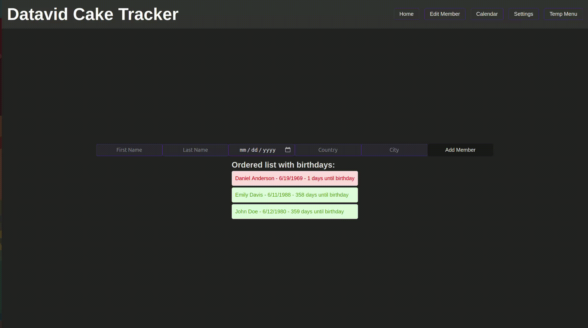

# Datavid Cake Tracker 🎂

Datavid Cake Tracker is a management tool designed to keep track of Datavid members' birthdays. This helps ensure that every member is celebrated, even in a remote, multinational company. 🎉

## Features

- ✨ Add a member with the following mandatory attributes:
  - 🧑‍🤝‍🧑 First Name
  - 🧑‍🤝‍🧑 Last Name
  - 📅 Birth Date
  - 🌍 Country
  - 🏙️ City
- 🔞 Validate that each member is at least 18 years old.
- 🆔 Ensure that the combination of first name, last name, and location is unique.
- 📜 View a list of all members and their information.
- 📆 View a sorted list of members by closest to date birthdays.
- ⚠️ Error handling with toast notifications.

## Frontend

### Tech Stack

- ⚛️ React
- 🟦 TypeScript
- 🎨 SCSS

### Components

- `App.tsx`: Main component integrating the member addition form and the member list.
- `AddMemberForm.tsx`: Form for adding new members.
- `MembersList.tsx`: Displays a list of all members.
- `MemberItem.tsx`: Displays individual member information.

### SCSS Structure

- `_variables.scss`: SCSS variables for theme and colors.
- `colors.scss`: Color definitions.
- `index.scss`: Global styles.
- `App.scss`: Styles for the main App component.
- `Header.scss`: Styles for the header component.

### Pages

- 🏠 Home: Main page with the form to add members and the list of all members.
- ✏️ Edit Member **WIP**: Page to search and edit existing members.
- 📅 Calendar **WIP**: Page with a calendar view to see birthdays.
- ⚙️ Settings **WIP**: Page for application settings.

## Backend

### Tech Stack

- 🐍 Django
- 🟧 Django Rest Framework

### Models

- `Member`: Represents a member with fields for first name, last name, birth date, country, and city. Validates that the member is at least 18 years old.

### Views

- `MemberListCreate`: API view to list and create members.
- `MemberListSorted`: API view to list members sorted by upcoming birthdays.

### Serializers

- `MemberSerializer`: Serializer for the Member model, including custom validation to ensure the member is at least 18 years old.

### Endpoints

- `POST /api/members/`: Add a new member.
- `GET /api/members/`: Retrieve a list of all members.
- `GET /api/members/sorted/`: Retrieve a list of members sorted by upcoming birthdays.

## Installation

### Prerequisites

- Ubuntu 22.04 or later
- Python 3.8 or higher
- Node.js 18.x or higher

### Step-by-Step Setup 📝

1. **Run Initial Setup Script**
   - This script will install necessary dependencies including Node.js.
   - ```bash
     bash setup_vm.sh
     ```

2. **Start the Servers**
   - After running the initial setup, use the start_server.sh script to start both backend and frontend servers.
   - ```bash
     bash start_servers.sh
     ```

3. **Cleanup (Optional)**
   - To clean up the environment, you can use the cleanup script.
   - ```bash
     bash vm_cleanup.sh
     ```Demo_gif.gif

## Usage 🚀

Once the setup is complete, you can access the application via `http://localhost:5173`. You will see the following sections:

- **Home**: Overview of all members and their birthdays
- **Edit Member WIP**: Add new members or update existing member information
- **Calendar WIP**: View a calendar with upcoming birthdays
- **Settings WIP**: Application settings and configurations

## Demo Video 🎥

Check out our short demo video showcasing the key features and how to use the Datavid Cake Tracker. 




## License 📜

This project is licensed under the MIT License. See the LICENSE file for more details.
